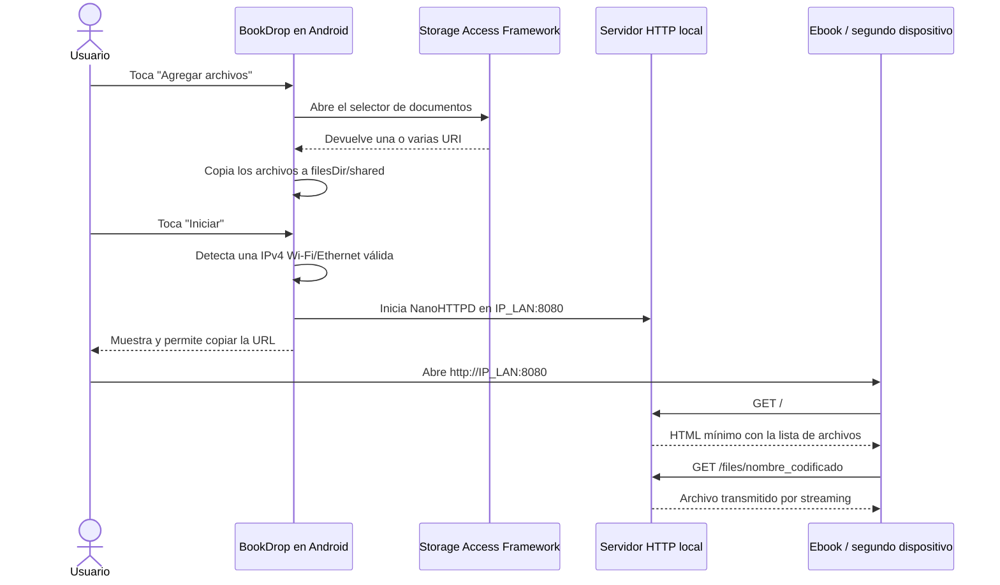
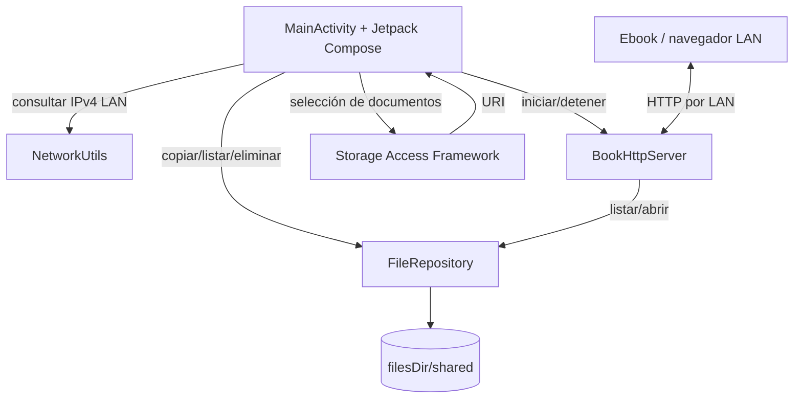

# BookDrop

<p align="center">
  <strong>Compartí libros y archivos desde un teléfono Android hacia dispositivos antiguos usando únicamente la red LAN.</strong>
</p>

<p align="center">
  
  
  
  
  
</p>

BookDrop convierte temporalmente un teléfono Android en un servidor HTTP local. El usuario selecciona archivos desde el explorador del sistema, inicia el servidor y abre la URL LAN mostrada por la app desde otro dispositivo conectado a la misma red Wi-Fi.

El proyecto nació para resolver un problema real: transferir libros a un ebook antiguo que todavía funciona, pero cuyo ecosistema quedó obsoleto.

> [!IMPORTANT]
> BookDrop es un MVP pensado para redes locales confiables. No implementa autenticación ni HTTPS. No debe utilizarse en una red pública o no confiable.

## Índice

- [Historia y motivación](#historia-y-motivación)
- [Qué problema resuelve](#qué-problema-resuelve)
- [Cómo funciona](#cómo-funciona)
- [Funciones incluidas](#funciones-incluidas)
- [Descarga e instalación](#descarga-e-instalación)
- [Uso](#uso)
- [Arquitectura](#arquitectura)
- [Flujos internos](#flujos-internos)
- [Servidor HTTP](#servidor-http)
- [Detección de la red LAN](#detección-de-la-red-lan)
- [Gestión de archivos](#gestión-de-archivos)
- [Seguridad y privacidad](#seguridad-y-privacidad)
- [Stack técnico](#stack-técnico)
- [Estructura del repositorio](#estructura-del-repositorio)
- [Compilación](#compilación)
- [Publicar el repositorio en GitHub](#publicar-el-repositorio-en-github)
- [Publicación de un APK](#publicación-de-un-apk)
- [Pruebas](#pruebas)
- [Solución de problemas](#solución-de-problemas)
- [Limitaciones conocidas](#limitaciones-conocidas)
- [Roadmap](#roadmap)
- [Desarrollo asistido por IA](#desarrollo-asistido-por-ia)
- [Licencia](#licencia)

---

## Historia y motivación

Tengo un ebook viejo que todavía sirve perfectamente para leer, pero quedó limitado por el hardware y por el abandono de su plataforma.

El lector:

- utiliza **micro-USB**, no USB-C;
- no tiene Bluetooth;
- sí tiene Wi-Fi;
- ya no recibe mantenimiento;
- ya no dispone de una tienda funcional desde la cual adquirir ejemplares;
- permite leer archivos propios, pero cargarlos se volvió cada vez menos práctico.

Durante años transferí libros conectándolo por cable a una computadora. Después cambié de PC y empecé a utilizar una MacBook que no tiene un puerto USB-A tradicional. Eso convirtió una tarea simple en una cadena de adaptadores, cables y pasos incómodos.

Al mismo tiempo, mi teléfono ya era suficiente para descargar, administrar e incluso convertir libros a formatos compatibles. El archivo final normalmente ya estaba en el celular, pero todavía tenía que encontrar una manera cómoda de llevarlo al ebook.

Retirar la tarjeta microSD del lector, colocarla en el teléfono y volver a insertarla tampoco era una solución aceptable. En mi caso, ese proceso afectaba o eliminaba el progreso registrado de las lecturas comenzadas.

La restricción útil era clara:

> El ebook no tiene Bluetooth ni una tienda activa, pero sí puede conectarse a Wi-Fi y abrir un navegador.

BookDrop aprovecha exactamente esa capacidad restante. En lugar de adaptar el ebook al teléfono, el teléfono expone temporalmente los archivos como una página web mínima que el lector antiguo puede abrir.

---

## Qué problema resuelve

Sin BookDrop, el flujo podía requerir:

1. descargar o convertir el libro en el teléfono;
2. moverlo a una computadora;
3. conectar un adaptador USB a la MacBook;
4. conectar el cable micro-USB del ebook;
5. esperar que el dispositivo sea reconocido;
6. copiar el archivo;
7. expulsar correctamente el lector.

Con BookDrop, el flujo se reduce a:

1. seleccionar el archivo en Android;
2. iniciar el servidor;
3. abrir la URL local desde el ebook;
4. tocar el nombre del libro para descargarlo.

No requiere:

- una computadora;
- un cable de datos;
- Bluetooth;
- una cuenta;
- almacenamiento en la nube;
- comandos de terminal;
- instalar una app adicional en el dispositivo receptor.

---

## Cómo funciona



El teléfono actúa como servidor. El ebook o segundo dispositivo actúa como cliente HTTP.

BookDrop no sube los archivos a Internet. Durante el uso normal, los datos viajan directamente entre los dispositivos de la red local.

---

## Funciones incluidas

### Aplicación Android

- Selección múltiple mediante el explorador de archivos del sistema.
- Copia de archivos al almacenamiento privado de la aplicación.
- Lista local de archivos disponibles.
- Eliminación individual de archivos.
- Inicio y detención manual del servidor.
- Detección de una dirección IPv4 LAN válida.
- Rechazo de direcciones de datos móviles, VPN y loopback.
- Visualización de la interfaz de red seleccionada.
- Botón para copiar rápidamente la URL.
- Mensajes de error mediante Snackbar.
- Indicador de progreso durante la importación.

### Interfaz web

- HTML deliberadamente simple.
- Sin JavaScript.
- Sin frameworks web.
- Sin recursos externos.
- Lista de enlaces de descarga.
- Compatibilidad priorizada con navegadores antiguos.

### Servidor

- Servidor HTTP embebido con NanoHTTPD.
- Enlace explícito a la IPv4 LAN seleccionada.
- Puerto fijo `8080`.
- Streaming de archivos sin cargarlos completos en memoria.
- MIME types comunes para ebooks, documentos e imágenes.
- `Content-Disposition` para conservar el nombre del archivo.
- Comprobación de que las rutas resueltas permanezcan dentro de la carpeta compartida.

---

## Descarga e instalación

El repositorio incluye un APK de depuración ya compilado:

```text
APK/BookDrop-v1.1.0-debug.apk
```

### Instalación manual

1. Abrir la carpeta `APK` del repositorio.
2. Descargar `BookDrop-v1.1.0-debug.apk`.
3. Abrirlo desde el navegador o gestor de archivos.
4. Autorizar temporalmente la instalación desde esa fuente si Android lo solicita.
5. Instalar BookDrop.

También se recomienda adjuntar el mismo archivo a una **GitHub Release**, porque así resulta más fácil de encontrar para visitantes no técnicos.

> [!NOTE]
> Es un APK `debug`, adecuado para probar y compartir este MVP. Para distribuir actualizaciones estables conviene generar builds `release` firmadas siempre con la misma clave privada.

### Verificación del archivo

SHA-256 del APK incluido:

```text
ea778e93e4fa0204c821a1b27ed8a94c2648d5a9ffe460d9f92c26c8497acba7
```

---

## Uso

### Requisitos de red

- El teléfono que ejecuta BookDrop y el dispositivo receptor deben estar conectados a la misma LAN.
- La opción habitual es que ambos estén conectados al mismo Wi-Fi.
- También puede funcionar con Ethernet, USB LAN o ciertos modos hotspot, dependiendo del dispositivo.
- Una VPN puede interferir con la selección de la interfaz correcta.
- Algunas redes de invitados impiden la comunicación entre clientes.

### Procedimiento

1. Conectar ambos dispositivos a la misma red Wi-Fi.
2. Abrir BookDrop.
3. Tocar **Agregar archivos**.
4. Seleccionar uno o varios EPUB, PDF u otros archivos.
5. Esperar a que finalice la copia.
6. Tocar **Iniciar**.
7. Verificar que aparezca algo similar a:

```text
Servidor LAN activo
http://192.168.1.34:8080
Wi-Fi · wlan0
```

8. Tocar el icono de copiar.
9. Abrir el navegador del ebook o segundo dispositivo.
10. Escribir la URL usando `http://`, no `https://`.
11. Tocar el nombre del archivo.
12. Detener el servidor cuando ya no sea necesario.

---

## Arquitectura

BookDrop mantiene una arquitectura pequeña y deliberadamente directa. El objetivo es que el proyecto sea comprensible, compilable y fácil de modificar sin introducir frameworks que no aporten valor al MVP.



### Responsabilidades

#### `MainActivity.kt`

- Posee el ciclo de vida principal de la aplicación.
- Mantiene una única instancia de `BookHttpServer`.
- Inicia y detiene el servidor.
- Coordina la interfaz Compose.
- Lanza el selector de documentos.
- Muestra el estado, la URL y los archivos.
- Detiene el servidor durante `onDestroy()`.

#### `data/FileRepository.kt`

- Crea y administra `filesDir/shared`.
- Consulta el nombre original mediante `OpenableColumns.DISPLAY_NAME`.
- Sanea nombres recibidos desde proveedores de documentos.
- Genera nombres únicos cuando hay colisiones.
- Copia streams usando `Dispatchers.IO`.
- Lista archivos en orden alfabético.
- Elimina archivos.
- Valida rutas mediante canonicalización antes de servirlas.

#### `network/NetworkUtils.kt`

- Inspecciona las redes conocidas por Android.
- Prioriza Wi-Fi y Ethernet mediante `ConnectivityManager`.
- Lee direcciones desde `LinkProperties`.
- Descarta VPN.
- Descarta IPv6 para maximizar compatibilidad con dispositivos antiguos.
- Descarta loopback, link-local y direcciones públicas.
- Usa `NetworkInterface` como mecanismo de respaldo para hotspot y USB LAN.

#### `server/BookHttpServer.kt`

- Extiende `NanoHTTPD`.
- Se enlaza a la IPv4 LAN seleccionada.
- Genera la página HTML.
- Codifica nombres para utilizarlos en URL.
- Escapa nombres antes de insertarlos en HTML.
- Devuelve archivos mediante streaming.
- Configura `Content-Type` y `Content-Disposition`.
- Responde con errores HTTP básicos.

#### `ui/theme/`

- Contiene la paleta, tipografía y tema Material 3.
- No contiene lógica de negocio.

---

## Flujos internos

### Importación de archivos

```text
OpenMultipleDocuments
        ↓
List<Uri>
        ↓
ContentResolver.openInputStream(uri)
        ↓
filesDir/shared/nombre_unico.ext
        ↓
Actualización de la lista Compose
```

Se realiza una copia real. BookDrop no depende de que el proveedor original mantenga disponible la URI después de cerrar el selector.

La carpeta efectiva pertenece al almacenamiento privado de la aplicación:

```text
/data/user/0/com.aistudio.bookdrop.mvp/files/shared
```

Esa ruta es conceptual y no necesita ser accesible manualmente por el usuario.

### Inicio del servidor

```text
Usuario toca Iniciar
        ↓
NetworkUtils.getLanAddress()
        ↓
IPv4 privada Wi-Fi/Ethernet válida
        ↓
BookHttpServer(hostname = IP, port = 8080)
        ↓
NanoHTTPD.start()
        ↓
URL visible y copiable
```

Si no hay una interfaz LAN apropiada, el servidor no se inicia.

### Descarga

```text
GET /files/archivo.epub
        ↓
URLDecoder
        ↓
FileRepository.getFileByName()
        ↓
Validación canonicalPath
        ↓
FileInputStream
        ↓
Respuesta HTTP por streaming
```

---

## Servidor HTTP

### Endpoints

| Método | Ruta | Descripción |
|---|---|---|
| `GET` | `/` | Lista los archivos disponibles. |
| `GET` | `/index.html` | Alias de la página principal. |
| `GET` | `/health` | Devuelve `BookDrop LAN OK`. |
| `GET` | `/files/{nombre}` | Transmite el archivo solicitado. |

Los demás métodos devuelven `405 Method Not Allowed`. Las rutas desconocidas devuelven `404`.

### Página generada

La respuesta principal es parecida a:

```html
<!doctype html>
<html>
<head>
    <meta charset="utf-8">
    <title>BookDrop</title>
</head>
<body>
    <h1>BookDrop</h1>
    <ul>
        <li><a href="/files/ejemplo.epub">ejemplo.epub</a></li>
    </ul>
</body>
</html>
```

No se utiliza JavaScript porque muchos ebooks antiguos incluyen navegadores limitados.

### MIME types incluidos

| Extensión | MIME type |
|---|---|
| `.epub` | `application/epub+zip` |
| `.pdf` | `application/pdf` |
| `.mobi` | `application/x-mobipocket-ebook` |
| `.azw3` | `application/x-mobi8-ebook` |
| `.txt` | `text/plain` |
| `.cbz` | `application/x-cbz` |
| `.cbr` | `application/x-cbr` |
| `.jpg`, `.jpeg` | `image/jpeg` |
| `.png` | `image/png` |
| otros | `application/octet-stream` |

### Encabezado de descarga

BookDrop agrega `Content-Disposition` con una variante tradicional y otra compatible con nombres UTF-8:

```http
Content-Disposition: attachment; filename="libro.epub"; filename*=UTF-8''libro.epub
```

---

## Detección de la red LAN

Seleccionar “la IP del teléfono” no es suficiente. Android puede exponer simultáneamente direcciones de:

- Wi-Fi;
- datos móviles;
- VPN;
- hotspot;
- Ethernet;
- USB tethering;
- loopback;
- interfaces virtuales.

BookDrop aplica una estrategia de prioridad:

1. consultar las redes mediante `ConnectivityManager`;
2. descartar transporte VPN;
3. aceptar únicamente Wi-Fi o Ethernet en la ruta principal;
4. leer IPv4 desde `LinkProperties`;
5. aceptar solo rangos privados:
   - `10.0.0.0/8`;
   - `172.16.0.0/12`;
   - `192.168.0.0/16`;
6. si no hay resultado, inspeccionar interfaces conocidas como `wlan`, `ap`, `eth`, `rndis` o `usb`;
7. rechazar prefijos típicos de datos móviles y túneles, como `rmnet`, `ccmni`, `tun`, `tap` o `wg`.

El servidor se enlaza específicamente a la dirección seleccionada. Esto evita anunciar una IP y escuchar accidentalmente en otra interfaz distinta.

---

## Gestión de archivos

### Selección

Se utiliza:

```kotlin
ActivityResultContracts.OpenMultipleDocuments()
```

Esto delega el acceso al Storage Access Framework y evita pedir permisos globales sobre todo el almacenamiento.

### Nombres

El nombre original se consulta con:

```kotlin
OpenableColumns.DISPLAY_NAME
```

Después se eliminan:

- segmentos de ruta;
- saltos de línea;
- tabulaciones;
- caracteres de control;
- nombres especiales `.` y `..`.

### Colisiones

Cuando un archivo ya existe, se conserva ambos mediante sufijos:

```text
libro.epub
libro_1.epub
libro_2.epub
```

### Prevención de traversal

Antes de abrir un archivo solicitado por HTTP se comparan las rutas canónicas:

```text
canonicalTarget.startsWith(canonicalShared + File.separator)
```

Un archivo solo se sirve cuando:

- existe;
- es un archivo regular;
- su ruta canónica permanece dentro de `filesDir/shared`.

---

## Seguridad y privacidad

### Modelo actual

BookDrop está diseñado para una red doméstica o confiable durante períodos cortos.

Incluye:

- servidor detenido por defecto;
- inicio explícito;
- detención manual;
- detención al destruirse la actividad;
- almacenamiento privado;
- ausencia de telemetría;
- ausencia de cuentas;
- ausencia de servicios en la nube;
- validación de rutas;
- escaping HTML;
- binding a la interfaz LAN seleccionada.

### Lo que no incluye

- autenticación;
- contraseña;
- token de sesión;
- HTTPS;
- cifrado de transporte;
- descubrimiento seguro;
- aislamiento por cliente;
- autorización por archivo.

Cualquier dispositivo con acceso a la misma LAN y conocimiento de la URL puede consultar y descargar los archivos mientras el servidor esté activo.

### Tráfico HTTP sin cifrar

El manifiesto contiene:

```xml
android:usesCleartextTraffic="true"
```

Esto es intencional. El objetivo es mantener compatibilidad con navegadores antiguos que pueden no manejar correctamente certificados modernos o autofirmados.

### Datos y backups

`android:allowBackup` está desactivado. Los archivos importados no deberían incorporarse al backup de la aplicación.

Al desinstalar BookDrop, Android elimina su almacenamiento privado, incluidos los archivos copiados dentro de `filesDir/shared`.

---

## Stack técnico

| Componente | Tecnología |
|---|---|
| Lenguaje | Kotlin `1.9.24` |
| UI | Jetpack Compose + Material 3 |
| Servidor embebido | NanoHTTPD `2.3.1` |
| Concurrencia | Kotlin Coroutines `1.9.0` |
| Selección de archivos | Storage Access Framework |
| Build system | Gradle `8.14.3` con Kotlin DSL |
| Android Gradle Plugin | `8.7.3` |
| Compile SDK | `36` |
| Target SDK | `34` |
| Min SDK | `26` — Android 8.0 |
| JVM target | Java 11 |

### Dependencias intencionalmente omitidas

El MVP no utiliza:

- Firebase;
- Room;
- Retrofit;
- Hilt;
- Navigation Compose;
- servicios externos;
- analytics;
- WebView;
- JavaScript.

---

## Estructura del repositorio

El repositorio se mantiene deliberadamente pequeño. Contiene solamente el APK instalable, el código necesario para compilar, este README y la licencia.

```text
BookDrop/
├── APK/
│   └── BookDrop-v1.1.0-debug.apk
├── app/
│   ├── src/main/
│   │   ├── java/com/aistudio/bookdrop/mvp/
│   │   │   ├── MainActivity.kt
│   │   │   ├── data/FileRepository.kt
│   │   │   ├── network/NetworkUtils.kt
│   │   │   ├── server/BookHttpServer.kt
│   │   │   └── ui/theme/
│   │   ├── res/
│   │   └── AndroidManifest.xml
│   ├── build.gradle.kts
│   └── proguard-rules.pro
├── gradle/
│   ├── libs.versions.toml
│   └── wrapper/
├── .gitignore
├── LICENSE
├── README.md
├── build.gradle.kts
├── gradle.properties
├── gradlew
├── gradlew.bat
└── settings.gradle.kts
```

No se incluyen cachés, archivos temporales del IDE ni directorios `build/`.

---

## Compilación

### Desde un teléfono Android

1. Descomprimir el repositorio.
2. Abrir la carpeta raíz `BookDrop` en un IDE Android compatible con proyectos Gradle.
3. Esperar la sincronización de Gradle.
4. Seleccionar la variante `debug`.
5. Ejecutar **Build** o **Run**.
6. Buscar el APK generado en:

```text
app/build/outputs/apk/debug/app-debug.apk
```

### Desde Android Studio

1. Instalar JDK 17 y Android Studio.
2. Clonar o descomprimir el repositorio.
3. Abrir la carpeta raíz `BookDrop`.
4. Esperar Gradle Sync.
5. Ejecutar:

```bash
./gradlew :app:assembleDebug
```

En Windows:

```bat
gradlew.bat :app:assembleDebug
```

El proyecto incluye el Gradle Wrapper completo. La primera compilación necesita Internet para descargar Gradle, el Android SDK requerido y las dependencias declaradas.

### Limpiar y recompilar

```bash
./gradlew clean :app:assembleDebug
```

---

## Publicar el repositorio en GitHub

1. Crear un repositorio público llamado `BookDrop`.
2. Subir **el contenido interior de esta carpeta** como raíz del repositorio.
3. Comprobar que GitHub muestre directamente `app/`, `APK/`, `README.md`, `LICENSE` y los archivos Gradle.
4. No subir la carpeta contenedora duplicada ni publicar únicamente este ZIP.

Descripción sugerida para GitHub:

> App Android de código libre para compartir libros y archivos por HTTP dentro de una red LAN, pensada especialmente para ebooks y dispositivos antiguos sin Bluetooth ni tienda activa.

Topics sugeridos:

```text
android kotlin jetpack-compose nanohttpd lan file-sharing ebook open-source
```

---

## Publicación de un APK

El APK compilado está versionado dentro de:

```text
APK/BookDrop-v1.1.0-debug.apk
```

Para facilitar la descarga también puede publicarse como archivo adjunto de una GitHub Release:

1. crear el tag `v1.1.0`;
2. crear una release llamada `BookDrop v1.1.0 — LAN MVP`;
3. adjuntar `APK/BookDrop-v1.1.0-debug.apk`;
4. aclarar que se trata de una build de depuración del MVP.

Para una versión futura, incrementar `versionCode` y `versionName`, compilar nuevamente y reemplazar el APK con un nombre de versión diferente.

## Pruebas

Prueba mínima antes de publicar una nueva versión:

1. Instalar el APK en Android 8.0 o superior.
2. Importar un EPUB.
3. Importar un PDF.
4. Importar dos archivos con el mismo nombre.
5. Comprobar que se genera el sufijo `_1`.
6. Conectar un segundo dispositivo a la misma red.
7. Iniciar el servidor.
8. Copiar la URL.
9. Abrir `/health`.
10. Abrir `/`.
11. Descargar ambos archivos.
12. Comparar tamaño y apertura.
13. Eliminar un archivo.
14. Detener el servidor.
15. Confirmar que la URL deja de responder.

El MVP fue validado en un escenario real con un teléfono Android como servidor y un ebook antiguo como cliente LAN.

---

## Solución de problemas

### La app muestra una IP incorrecta

- Desactivar temporalmente la VPN.
- Confirmar que el teléfono esté conectado a Wi-Fi.
- Detener y volver a iniciar el servidor después de cambiar de red.
- Verificar que la dirección pertenezca a `10.x.x.x`, `172.16–31.x.x` o `192.168.x.x`.

### La página abre en el teléfono, pero no en el ebook

- Ambos dispositivos deben estar en la misma red.
- No usar una red Wi-Fi de invitados.
- Revisar si el router tiene activado **AP isolation**, **client isolation** o una opción equivalente.
- Escribir `http://` explícitamente.
- Mantener BookDrop abierto durante la prueba.
- Probar `http://IP:8080/health` desde otro teléfono.

### El navegador intenta usar HTTPS

Escribir la dirección completa:

```text
http://192.168.1.34:8080
```

No usar:

```text
https://192.168.1.34:8080
```

### El puerto 8080 está ocupado

Cerrar otras aplicaciones que puedan ejecutar servidores locales y volver a iniciar BookDrop.

### Android detiene la aplicación

El MVP no utiliza un foreground service. Mantener la aplicación visible y evitar restricciones agresivas de batería durante una transferencia.

### El archivo aparece pero no abre en el ebook

BookDrop transporta el archivo, pero no convierte formatos. Confirmar que el lector soporte la extensión y que el archivo no esté dañado ni protegido por DRM.

### La compilación falla por falta de SDK

Instalar la plataforma correspondiente a `compileSdk = 36` desde el SDK Manager del entorno utilizado.

### El wrapper no puede descargarse

- Verificar conexión a Internet.
- Verificar que exista `curl`, `wget` o PowerShell según el sistema.
- Ejecutar nuevamente la compilación.

---

## Limitaciones conocidas

- Solo funciona dentro de una red LAN alcanzable.
- No atraviesa Internet ni realiza port forwarding.
- No tiene autenticación.
- No tiene HTTPS.
- Usa un puerto fijo.
- No genera QR.
- No implementa descubrimiento mDNS.
- No funciona como foreground service.
- Puede detenerse si Android destruye la actividad.
- No incluye solicitudes HTTP Range ni reanudación avanzada.
- No convierte formatos.
- No elimina DRM.
- No sincroniza progreso de lectura.
- No gestiona metadatos EPUB.
- No contiene una base de datos.
- Los archivos importados se duplican dentro del almacenamiento privado.
- Al desinstalar la aplicación se eliminan esas copias.

Estas limitaciones son parte consciente del alcance del MVP.

---

## Roadmap

Posibles mejoras futuras, sin compromiso de implementación:

- foreground service con notificación persistente;
- apagado automático por inactividad;
- token aleatorio por sesión;
- código QR de la URL;
- puerto configurable;
- soporte de `HEAD` y `Range`;
- progreso de transferencias;
- metadatos y portada de EPUB;
- filtro por formatos;
- historial de descargas;
- pruebas unitarias e instrumentadas;
- release firmada estable;
- traducción de la interfaz;
- descubrimiento mediante mDNS cuando sea compatible.

---

## Desarrollo asistido por IA

BookDrop fue desarrollado mediante un flujo de **programación asistida por inteligencia artificial**, utilizando principalmente:

- **OpenAI Codex**;
- **OpenCode**.

Las herramientas se utilizaron para generar, revisar, reorganizar y depurar partes del proyecto. El proceso no consistió en aceptar una única generación sin validación: los requisitos surgieron de un problema real, la aplicación se compiló, se instaló y se probó entre dispositivos físicos, y los errores de red LAN se corrigieron mediante iteración.

La autoría del proyecto comprende:

- la definición del problema;
- las decisiones de producto;
- el alcance del MVP;
- la dirección de los prompts;
- la selección y evaluación de las propuestas de código;
- la compilación;
- las pruebas en hardware real;
- la detección de fallos;
- la validación final del funcionamiento.

Esta declaración busca ser transparente sobre el proceso de construcción y, al mismo tiempo, documentar un flujo moderno de desarrollo asistido por agentes.

---

## Contribuciones

Las contribuciones, forks y modificaciones son bienvenidos. El objetivo es conservar una herramienta pequeña, comprensible y compatible con dispositivos antiguos.

Cualquier persona puede usar el código, estudiarlo, modificarlo y redistribuirlo respetando los términos de la licencia MIT.

---

## Licencia

BookDrop se distribuye bajo la licencia MIT. Consultar [`LICENSE`](LICENSE).

NanoHTTPD conserva su propia licencia y derechos correspondientes como dependencia externa.

---

## Estado del proyecto

**MVP funcional.**

La función principal está implementada y validada:

- seleccionar archivos en Android;
- servirlos desde una IP LAN correcta;
- copiar rápidamente la URL;
- acceder desde otro dispositivo;
- descargar los archivos mediante un navegador.

El proyecto no pretende reemplazar una plataforma completa de biblioteca digital. Pretende resolver bien un problema pequeño, concreto y real.
